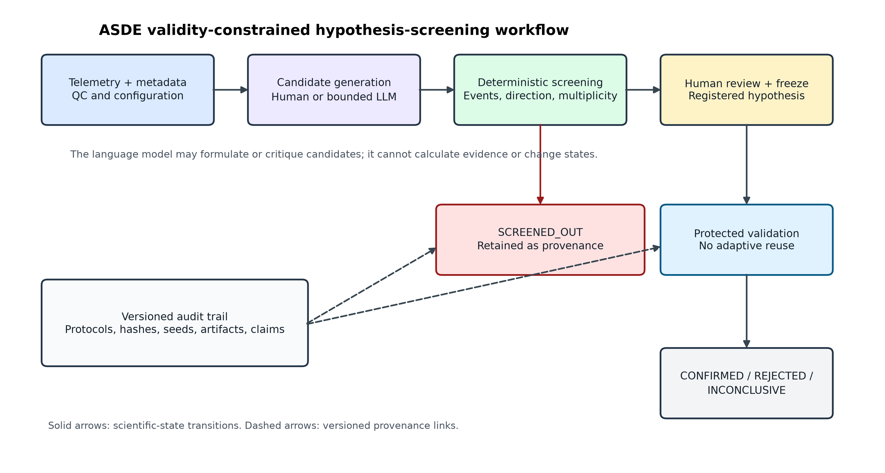
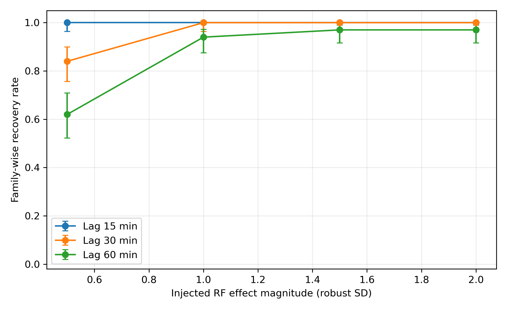
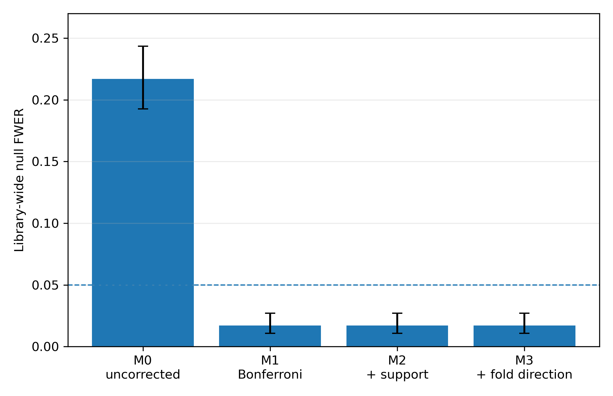

# ASDE — Manuscrito de métodos para IEEE Access — Borrador completo v 2

> **TRADUCCIÓN DE TRABAJO — NO DESTINADA A ENVÍO EDITORIAL.** La versión inglesa es el manuscrito fuente oficial para IEEE Access.

> Borrador de trabajo. No está listo para envío. Dictamen integrado del Metarrevisor: PROCEDER — NO SE DETECTÓ NINGÚN MOTIVO TÉCNICO FATAL DE RECHAZO PARA LAS AFIRMACIONES METODOLÓGICAS ACOTADAS. El Revisor A mantiene DISEÑO APROBADO / CALIBRACIÓN PROSPECTIVA PENDIENTE; el Revisor B está cerrado únicamente para las afirmaciones metodológicas de telemetría operacional explícitamente acotadas; el Revisor C mantiene DISEÑO APROBADO / BÚSQUEDA FINAL DE NOVEDAD Y CONFORMIDAD DE ENVÍO PENDIENTES. Aún no están sustentadas la sensibilidad a desvanecimientos físicos, la atribución de propagación natural, el control de errores en todo el ámbito, la transportabilidad entre enlaces ni la utilidad incremental de la IA. Las tasas del banco de pruebas están condicionadas a un único fondo de desarrollo. La inyección MCS original es una perturbación matemática de la telemetría, no un desvanecimiento radioeléctrico físico.

## Título de trabajo actual
**ASDE: Un flujo de trabajo auditable para el cribado de hipótesis en telemetría ambiental–radio de larga duración**

**CARLOS JESÚS KOO LABRÍN 1, VÍCTOR SÁNCHEZ CÁCERES 1, NÉSTOR E. MUÑOZ ABANTO 1, MARISOL TAPIA ROMERO 1, CARLOS ENRIQUE KOO BARTRA 2**

1 Universidad Nacional de Cajamarca, Cajamarca, Perú

2 Universidad Privada del Norte, Trujillo, Perú

**Autor de correspondencia:** Carlos Jesús Koo Labrín (correo electrónico: ckoo@unc.edu.pe)

ASDE sigue siendo el nombre del proyecto/sistema. En este manuscrito, **flujo de trabajo de descubrimiento** designa el proceso adaptativo más amplio que abarca desde la generación de candidatos hasta su falsificación y el cribado acotado de hipótesis; no implica descubrimiento autónomo de alcance abierto ni identificación causal.

## Resumen
La telemetría ambiental–radio de larga duración puede producir patrones plausibles pero inestables, porque la dependencia temporal, la exploración adaptativa, el soporte de observación heterogéneo y las pruebas repetidas difuminan la frontera entre la generación de candidatos y la evidencia. Este artículo presenta el AtmosLink Scientific Discovery Engine (ASDE), un flujo de trabajo auditable para el cribado acotado de hipótesis. Su núcleo determinista registra las adaptaciones, impone reglas de control de calidad y soporte de eventos, aplica pruebas ordenadas temporalmente y corrección por multiplicidad, congela las hipótesis elegibles y protege un bloque de validación. Una interfaz restringida de modelo de lenguaje puede formular o criticar candidatos, pero no puede calcular evidencia ni modificar estados científicos. ASDE se evaluó con telemetría de un enlace rural de alta montaña, de aproximadamente 12 km y 6 GHz. Seis candidatos atmosférico–RF naturales fueron descartados antes de la validación. En una auditoría congelada de conductor oculto con cuatro conductores, condicionada a un único fondo de desarrollo y una biblioteca finita preespecificada, la selección del conductor exacto ante un desplazamiento registrado de 1.0 unidades de escala de referencia fue de 85.3 %, 79.0 % y 21.3 % a 15, 30 y 60 min, respectivamente. Una ablación anidada redujo la selección bajo el nulo sustituto de desplazamiento circular de 21.7 % sin corrección por multiplicidad a 1.7 % con corrección de Bonferroni; los criterios posteriores de soporte y dirección entre pliegues no modificaron los conjuntos seleccionados en 4,600 ensayos pareados. Una perturbación RSSI/SNR de 2 dB, congelada por separado, y un análisis posterior de rendimiento útil en el mismo enlace acotaron la interpretación física de la perturbación compuesta original. Los diagnósticos posteriores a la auditoría mostraron además que las políticas de observación RF y las representaciones del resultado modificaron de manera sustancial el soporte de eventos y la recuperación. Estos resultados caracterizan un flujo de trabajo reproducible de cribado, no un mecanismo de propagación natural: no establecen control de errores en todo el ámbito, transportabilidad entre enlaces, causalidad atmosférica ni utilidad incremental de la IA.

## Términos índice
análisis adaptativo de datos; monitoreo ambiental; cribado de hipótesis; inteligencia artificial con intervención humana; pruebas de hipótesis múltiples; telemetría de radio; investigación reproducible; análisis de series temporales; mediciones inalámbricas.

# I. Introducción

Los enlaces inalámbricos operativos exponen cada vez más largos registros de telemetría que contienen fuerza de señal recibida, relación de señal a ruido, estado de modulación, rendimiento, latencia, retransmisiones, disponibilidad y, en implementaciones instrumentadas, mediciones ambientales colocadas. Estos registros pueden apoyar la investigación científica además de la vigilancia de la red. También crean un peligro metodológico: una asociación plausible encontrada después de muchas transformaciones, umbrales, ventanas temporales y comparaciones de candidatos puede parecer más estable y más explicativo de lo que las pruebas justifican.

La dificultad no es sólo predictiva. La telemetría ambiental–radio es temporalmente dependiente, sus variables se observan en configuraciones cambiantes y condiciones de calidad, y un episodio sostenido puede generar muchas filas correlativas sin proporcionar muchos eventos independientes. Además, cada resultado exploratorio puede cambiar la próxima consulta o representación. Por lo tanto, el análisis adaptable repetido compromete las interpretaciones de retención ingenuas, mientras que la inferencia post-selección requiere una contabilidad explícita para la exploración y selección [REUSABLE-HOLDOUT-2015, POST-SELECTION-2022]. El diseño de Benchmark también puede crear un progreso aparente cuando la estructura temporal, los límites de eventos o las definiciones de anomalía son insuficientemente controladas [TSAD-BENCHMARKS-2023].

La aparición de la ciencia asistida por AI hace que esta distinción sea más consecutiva.El Científico de AI, El Científico-v 2, Co-científico y Robin demuestran apoyo automatizado o agenteico para la ideación, experimentación, crítica, análisis y generación de manuscritos.[AI-SCIENTIST-2024, AI-SCIENTIST-V2-2025, CO-SCIENTIST-2026, ROBIN-2026]. Las parejas POPPER falsificación de agentes con control secuencial de tipo I-error, y ControlA introduce salvaguardias a nivel de flujo de trabajo y agente en la infraestructura de conocimiento de la procedencia [POPPER-2025, CONTROLA-2025]. Estos avances establecen que la generación de hipótesis, la crítica, las puertas de validación y la procedencia son el arte anterior. También agudizan la pregunta de ingeniería no resuelta: ¿cómo debe limitarse esa capacidad cuando la evidencia consiste en la telemetría de campo operacional autocorriente y el espacio de hipótesis evoluciona durante la investigación?

Las variables generadas por radio se han utilizado para la detección de anomalías, el análisis de propagación y la detección ambiental; los estudios comerciales de enlace con microondas, en particular, muestran que las mediciones de señales recibidas pueden contener información sobre las condiciones atmosféricas [RADIO-DT-2025, MESSER-2006, LEIJNSE-2007, UIJLENHOET-2018]. La mayoría de estos estudios comienzan con un objetivo predefinido, como una clase de anomalías, precipitación o atenuación, y luego evalúan la recuperación o predicción. El problema actual es diferente: los candidatos emergen durante el análisis adaptativo, el soporte de observación puede variar a través de RF variables, asuntos de orden temporal, y un resultado científicamente responsable puede ser el examen de cada candidato aparentemente prometedor.

Por lo tanto, la brecha de investigación no es la ausencia de otro agente generador de hipótesis u otra salvaguardia estadística aislada. Lo que queda insuficientemente caracterizado en la literatura citada es un relato de campo orientado, ejecutable, de cómo la generación de candidatos adaptables, elegibilidad de control de calidad, apoyo a nivel de eventos, falsificación temporal, control de multiplicidad, congelación de hipótesis, validación protegida y probabilidad de fallos se comportan juntos en la telemetría ambiental de radio de larga duración. En particular, las características operativas de tal flujo de trabajo combinado deben medirse en virtud de protocolos congelados, y las reclamaciones resultantes deben mantenerse condicionadas a los datos de antecedentes, el modelo de perturbación, la política de observación y la biblioteca de candidatos finitos utilizados en la auditoría.

Este artículo aborda esa brecha a través de ASDE, un flujo de trabajo con restricciones de validez implementado y evaluado en telemetría de una alta altitud rural 6- enlace GHz. El estudio pregunta si el flujo de trabajo puede (i) rechazar candidatos naturales no soportados antes de la validación, (ii) recuperar un conductor plantado oculto dentro de una biblioteca predeterminada bajo tensiones temporales controladas, (iii) identificar qué puertas cambian materialmente el comportamiento de selección, y (iv) exponer sensibilidad a RF Definiciones de resultados y apoyo a la observación, el principio fundamental es:**la generación de candidatos no es evidencia, y el ranking no es validación**.ASDE Por lo tanto separa una interfaz de estilo lingüístico ligada del cálculo de evidencia determinista y las transiciones estatales, congela las hipótesis elegibles antes del uso de datos protegidos, y conserva a los candidatos rechazados como procedencia científica.

Las contribuciones son contribuciones para la ejecución y la evaluación;ASDE no afirma que sus salvaguardias individuales son nuevos primitivos:

1. **Flujo de trabajo con moderación:**un procedimiento implementado para el medio ambiente autocorrelacionado RF telemetría que registra el análisis adaptativo, impone QC- la elegibilidad basada y el apoyo a nivel de eventos, aplica el control de la dirección temporal y la multiplicidad, congela las hipótesis elegibles y preserva un bloque de validación analíticamente protegido.
2. **Auditorías de carácter experimental congeladas:**a known-driver audit and a bounded hidden-driver attribution audit that quantify recovery, ranking, distraor co-selection, and circular-shift surrogate-null selection on one real AtmosLink fondo de desarrollo y dentro de una biblioteca de conductores predeterminada finita.
3. **Caracterización fallida:**anidado ablación de puertas, morfología y analógica RF tensiones,RF- Sensibilidad de salida, sensibilidad a las políticas de observación, contabilidad de apoyo a eventos y análisis de fondo específicos para conductores que delimitan lo que el parámetro de referencia auditado hace y no apoya.
4. **Probabilidad negativa-candidato:**un estudio de caso de datos naturales en el que seis aparentemente prometedores atmosféricos –RF Los candidatos fueron examinados antes de la validación protegida y retenidos en el registro científico, demostrando que la atrición del candidato es un resultado de flujo de trabajo previsto.
5. **Reproducibilidad y disciplina de reclamación:**protocolos versionados, snapshots de datos, hashes, artefactos de prueba cruda, scripts de reconstrucción, restricciones de reclamación a evidencia, y auditorías ejecutables que conectan los resultados reportados a sus pruebas generadoras.
6. **Función de modelo lingüístico:**una interfaz limitada que puede formular y criticar a los candidatos, pero permanece separada del motor de pruebas deterministas; el piloto actual sólo admite el cumplimiento de los contratos y no establece la utilidad científica incremental.

# II. Trabajos relacionados

## A. AI-Assisted and Autonomous Scientific Discovery
El Científico de AI introdujo un marco de extremo a extremo que genera ideas de investigación, implementa experimentos, analiza resultados y escribe documentos de investigación en dominios de aprendizaje automático [AI-SCIENTIST-2024]. The AI Scientist-v 2 extended this approach using agentic tree search and a dedicated experiment manager [AI-SCIENTIST-V2-2025]. Co-científico utiliza agentes especializados para la generación de hipótesis, reflexión, clasificación y evolución, y ha sido evaluado en entornos biomédicos con validación experimental de aguas abajo [CO-SCIENTIST-2026]. Robin integra la búsqueda de literatura, la generación de hipótesis, la estrategia experimental y el análisis de resultados de laboratorio en un flujo de trabajo multiagente iterativo [ROBIN-2026].

POPPER es especialmente relevante porque trata la validación de hipótesis de forma libre como un problema de falsificación y pruebas generadas por agentes de parejas para el control estadístico secuencial [POPPER-2025]. ControlA es igualmente relevante desde el lado de la confiabilidad: propone instrumentación de flujo de trabajo, salvaguardias a nivel de agente y mecanismos de control de eficacia probada para flujos de trabajo científicos fiables [CONTROLA-2025]PROV-AGENT formaliza aún más la procedencia centrada en los agentes, incluyendo los impulsos, las respuestas y las decisiones, dentro de los flujos de trabajo científicos finales a extremos [PROV-AGENT-2025]. La construcción de hipótesis Human-AI también se establece en el arte anterior: HypoChainer combina expertos,LLM razonamiento, gráficos de conocimiento y priorización orientada a validación [HYPOCHAINER-2026], mientras Lin et al. se integran LLM- generación de hipótesis impulsada con evidencia meta-analítica estadísticamente apoyada [LLM-META-2025]. Agentic AI también ha entrado en el dominio inalámbrico para la optimización de red/antena autónoma [AGENTIC-WIRELESS-2026].

El trabajo reciente restringe aún más el reclamo arquitectónico. THREAD-Bio propone puertas de validación sensibles a las consecuencias, perfiles de derechos de decisión y trazabilidad de reclamo a evidencia para bioinformática agente confiable [THREAD-BIO-2026]. Sargsyan propone la aplicación estructural del rigor estadístico en el descubrimiento impulsado por AI, incluyendo el control de la tasa de descubrimiento falso en línea y la separación declarativa de la exploración de datos de validación [SARGSYAN-RIGOR-2025]. Emerging preprints also describes verification-first workflow states and publication gates (Plato-Bio), Git-like research protocols with failed-branch and claim-to-evidence provenance (XScientist), and claim-to-evidence trace graphs for agent auditing (LEDGER)[PLATO-BIO-2026, XSCIENTIST-2026, LEDGER-2026].

El trabajo de referencia reciente también hace que la semántica del "descubrimiento científico" sea más exigente. TruthInsightBench retiene las conclusiones de origen y las trayectorias de análisis en tareas de datos reales ciegos y evalúa la madurez, los controles, la robustez, la falsificación y la generalización cruzada.[TRUTHINSIGHT-2026]SDABench separa las capacidades descriptivas, exploratorias, inferenciales, predictivas, causales y mecanicistas [SDABENCH-2026]. BioDSA-1 K incluye hipótesis para las cuales los datos disponibles son insuficientes para apoyar o refutar una reclamación [BIODSA-2025], mientras que BLADE evalúa decisiones de ciencia de datos abiertas con múltiples trayectorias analíticas válidas [BLADE-2024]. La hipotetización atómica con experimentación aguas abajo y revisión experta también se establece arte anterior [EXPERIGEN-2026], y la propia abstención se ha convertido en un objetivo explícito de evaluación de los agentes [ABSTENTION-2026].

En consecuencia,ASDE no pretende inventar falsificación de agentes, puertas de validación, máquinas de estado científico, procedencia de reclamación a evidencia, validación protegida, abstención, soporte estadístico LLM Hipótesis, construcción de hipótesis humana-AI, o IA agenteica para sistemas inalámbricos. Tampoco presenta su punto de referencia de cuatro goteros como descubrimiento científico de composición abierta. La contribución defensible es empírica y con dominio: un flujo de trabajo implementado que combina controles de validez con falsificación temporal a nivel de eventos para el medio ambiente autocorregido RF telemetría y evalúa la detección y el comportamiento de atribución ligado en un verdadero campo-medición de fondo.

## B. Análisis de Adaptación, Inferencia de Post-Selección y Validez de Benchmark
Los sistemas de descubrimiento científico son intrínsecamente adaptables: cada patrón observado puede cambiar la próxima consulta, modelo, umbral o representación. La literatura reutilizable formalizó el peligro general de la repetida reutilización adaptativa de datos, mientras que la inferencia post-selección proporciona un marco más amplio para la inferencia después de la exploración o selección de modelos [REUSABLE-HOLDOUT-2015, POST-SELECTION-2022]. Las auditorías de los sistemas de científicos de inteligencia artificial identifican aún más la selección de puntos de referencia, la fuga de datos, el uso indebido métrico y la selección posterior a la investigación como modos de falla a nivel de flujo de trabajo que pueden ocultarse mediante un informe final pulido [AI-SCIENTIST-PITFALLS-2025].ASDE Una vez que el bloque de caracterización designado originalmente se había inspeccionado repetidamente durante el desarrollo, se reclasificó oficialmente como datos de desarrollo en lugar de seguir descrito como réplica independiente.

Esta distinción también se aplica a los parámetros de referencia. La investigación sobre anomalías en las series temporales ha demostrado que la construcción de puntos de referencia puede distorsionar materialmente los progresos aparentes [TSAD-BENCHMARKS-2023].ASDE Por lo tanto, separa el desarrollo de puntos de referencia exploratorios de las operaciones de auditoría posterior a la congelación, registra el protocolo y estado de aleatorización antes de la simulación confirmatoria, y conserva variantes de referencia fallidas o superadas como procedencia.

## C. Análisis inalámbrico/ambiental
Detección de anomalías inalámbricas y detección ambiental oportunista ya utilizan variables radio-derived tales como RSSI,SNR, nivel de señal recibido y atenuación. El trabajo digital reciente evalúa la detección de anomalías de aprendizaje automático en entornos de radio simulados [RADIO-DT-2025]. Separadamente, la detección ambiental de enlaces de microondas tiene una importante literatura anterior: se han utilizado enlaces comerciales de comunicación para inferir precipitaciones y otra información atmosférica de atenuación de señales y mediciones de potencia recibida [MESSER-2006, LEIJNSE-2007, UIJLENHOET-2018]. En los trabajos recientes también se ha examinado la contribución de las variables ambientales a la estimación de las precipitaciones relacionadas con las microondas comerciales [SPACKOVA-2025]. Por consiguiente,ASDE no reclama novedad de la premisa de que las mediciones de estado y radio atmosférico pueden estar relacionadas estadísticamente.

La distinción metodológica propuesta en ASDE es más estrecho. En lugar de comenzar con un objetivo fijo como la recuperación de precipitaciones, la clase de anomalías o una respuesta de propagación predeterminada, el flujo de trabajo gestiona las relaciones candidatas que emergen durante el análisis adaptativo y los somete a QC elegibilidad, independencia a nivel de eventos, pruebas de dirección temporal, control de multiplicidad, restricciones de procedencia y congelación de hipótesis antes de la validación protegida. Esto crea un problema de evaluación diferente de la predicción supervisada convencional, recuperación de objetivos fijos o clasificación de anomalías.

## D. Estructura del dominio y Ablación controlada
Equi-mRNA proporciona una analogía metodológica útil de un dominio diferente: la estructura de dominio está codificada explícitamente y evaluada a través de comparación controlada en lugar de dejar como comportamiento modelo implícito [EQUI-MRNA-2025].ASDE aplica un principio conexo a nivel de flujo de trabajo.RF y la estructura atmosférica entra a través de definiciones de eventos,QC Elegibilidad, orden de tiempo, metadatos de configuración y estados científicos explícitos. A continuación, las ablaciones cuantifican el costo y beneficio de las salvaguardias en lugar de tratar todo el flujo de trabajo como un sistema AI opaco.

# III. Plataforma experimental y gobernanza de datos

## A.AtmosLink Plataforma sobre el terreno
AtmosLink es una plataforma de investigación inalámbrica de alta altitud rural desplegada en Cajamarca, Perú.CU01 aproximadamente 2,730 m sobre el nivel del mar y SJ01 aproximadamente 3,650 m sobre el nivel del mar sobre un 12-km line-of-sight path.6 El enlace experimental GHz utiliza equipo Cambium ePMP 4600 C, con CU01 operando como el punto de acceso / el lado principal y SJ01 como el lado del suscriptor.

La detección meteorológica local está disponible en ambos sitios.DISCOVERY-001 variables CU01 temperatura, humedad relativa y presión;SJ01 temperatura, humedad relativa, presión y velocidad del viento; y RF variables DL/UL RSSI,DL/UL SNR, y DL/UL MCS Los productos externos como ERA 5-Land y NASA POWER son mantenidos por el más amplio AtmosLink plataforma para tareas contextuales y de reconciliación, pero no son necesarias para la primaria DISCOVERY-001 En el cuadro I se resume la plataforma sobre el terreno y el papel analítico de cada componente.

**CUADRO I**
**PLATFORMA FIELD ATMOSLINK Y VARIABLES ANÁLITICOS PRIMARES**

|Componente|Función y elevación aproximada|Variables utilizadas en DISCOVERY-001|
|---|---|---|
|CU01|Access-point/master site;2,730 m sobre el nivel del mar|Temperatura, humedad relativa, presión;DL/UL RF telemetría|
|SJ01|Sitio del suscriptor;3,650 m sobre el nivel del mar|Temperatura, humedad relativa, presión, velocidad del viento;DL/UL RF telemetría|
|6- Acoplamiento de alta calidad|Aproximadamente 12- kilómetros de camino de visión|RSSI,SNR, y codificado MCS en ambas direcciones|
|Cohorte primario|7000 MHz /20 Configuración MHz|3,576 observaciones completas partidas cronológicamente|

## B. Cohorte y configuración primarias
La primaria DISCOVERY-001 cohorte utiliza el 7000 MHz /20 Configuración MHz desde la configuración integrada 6 Exportación de la campaña GHz. El archivo fuente registrado contiene 3,576 observaciones de núcleo completo para esta configuración y se identifica por SHA-256 en el manifiesto del experimento.

La partición cronológica original era:
- descubrimiento:2,145 observaciones;
- caracterización:715 observaciones;
- validación:716 observaciones.

No se utilizó ninguna división de filas al azar. El bloque de validación abarca el intervalo final registrado y está marcado como embargo para el descubrimiento científico.

## C. Reclasificación adaptativa de los datos sobre el desarrollo
Durante v 1–v 5, tanto los bloques de descubrimiento y caracterización originales fueron inspeccionados repetidamente al elegir representaciones, umbrales, definiciones de eventos, estructuras de agrupación y reglas de selección. Por lo tanto, la descripción continua del bloque de caracterización como réplica independiente superaría su estatus inferencial.ASDE reclasificado formalmente el primero 2,860 observaciones como D_development y reservado el final 716 observaciones como D_validation.

El conjunto de desarrollo se evalúa utilizando cuatro pliegues temporales contiguos 715 observaciones cada uno. Estos pliegues soportan el análisis de la robustez pero no se describen como confirmación externa. Esta política trata explícitamente la repetición de la inspección humana/AI como una fuente de ajuste adaptativo.

El 716-observación El bloque D_validation sigue estando analíticomente aislado de la selección de candidatos, el ajuste, la detección y el desarrollo de puntos de referencia.ASDE no afirma que los bytes de fuentes subyacentes nunca fueron leídos históricamente cuando la partición fue construida por primera vez; la afirmación científica es más estrecha y auditable: los valores de validación no se han utilizado como evidencia en el oleoducto activo de desarrollo de candidatos.

Adicional 6 Las cohortes de configuración de GHz están registradas para la futura replicación de la configuración cruzada, incluyendo 6475/20 MHz,6655/20 MHz,7000/40 MHz y 6655/40 MHz.6475/20 se utiliza a continuación para una asociación de buena comunicación post-audita congelada por separado en el mismo enlace físico; no es evidencia confirmatoria para las reclamaciones de referencia de la hipótesis meteorológica original o de seis campos. Las otras configuraciones alternas permanecen inutilizadas.

# IV. Arquitectura de ASDE

## A. Máquina científica del Estado
ASDE usa un modelo estatal explícito en lugar de tratar cada asociación de alto nivel como resultado:

CANDIDATE - títuloSCREENED_OUT

o

CANDIDATE - títuloHUMAN_REVIEWED- título HYPOTHESIS - confiar FROZEN - título VALIDATING - confianza CONFIRMED Silencio REJECTED Silencio INCONCLUSIVE.

Un intermediarioEVIDENCE_ACCUM UL ATINGel estado puede ser utilizado durante el desarrollo cuando un patrón es direccionalmente persistente, pero sigue siendo demasiado incierto para la promoción de la hipótesis. Los identificadores candidatos son inmutables, y los candidatos descartados permanecen en el registro.

La máquina estatal es intencionadamente asimétrica: la promoción requiere evidencia adicional, mientras que la falsificación puede ocurrir en cualquier puerta de detección registrada. Ninguna salida del modelo de lenguaje puede ejecutar directamente una transición de promoción.1 muestra la separación entre la formulación del candidato, la detección determinista, la congelación humana, la validación protegida y la capa de procedencia versionada.

**Fig.1.**ASDE flujo de trabajo de filtración de hipótesis con restricciones de validez. La interfaz de modelo de lenguaje puede formular o criticar candidatos, pero no puede calcular evidencia, alterar umbrales, acceder a validación protegida para la exploración, o ejecutar transiciones de estado científico.

## B.QC-Aware Feature Eligibility
Un motor de descubrimiento científico puede confundir fácilmente artefactos de instrumentación para la estructura física.ASDE Por lo tanto, trata el estado de control de calidad como parte del espacio de hipótesis en sí. Las características pueden seguir siendo elegibles como niveles contextuales, mientras que sus derivados están en cuarentena de la generación de candidatos si se sabe que los cambios rápidos son inconfiables.

Un ejemplo concreto ocurrió para CU01 El informe sobre la calidad de la prevalidación contenía repetidasPRESS_JUMPadvertencias, incluyendo cambios extremos a corto plazo capaces de dominar los derivados estandarizados.ASDE El nivel de presión retenido como información contextual pero excluyó su derivación rápida del descubrimiento de la transición hasta que se pudiera restaurar la elegibilidad de la señal. Esto no es una eliminación post hoc de datos inconvenientes; es una norma de funcionalidad registrada vinculada a una condición documentada de calidad de sensor.

## C. Representación temporal de los acontecimientos
Las repetidas filas de telemetría no se tratan como evidencia científica independiente.ASDE construye representaciones de eventos o episodios con intervalos refractarios para que un estado persistente no pueda aportar decenas de observaciones nominalmente independientes.

Las transiciones atmosféricas se derivan de cambios cortos en las variables meteorológicas, mientras que RF la respuesta está representada mediante sólidas combinaciones estandarizadas de DL/UL RSSI,SNR, y MCS Dependiendo de la versión del experimento, el motor estudia el estado de degradación absoluta, la transición a la degradación o la caída de calidad aguda.

El composite RF La puntuación de calidad es un sustituto operacional de la telemetría, no una medición calibrada de la atenuación, disponibilidad o rendimiento de la ruta.MCS campos contienen códigos enteros 1 xx/2 xx cuya cartografía de proveedores aún no ha sido verificada independientemente. Las reclamaciones temporales son orientativas. Si se propone un evento atmosférico como precursor,ASDE comparaciones RF eventos antes y después de ese evento. El enriquecimiento a nivel de bloque es insuficiente.

Para evento atmosférico$i$a la vez$t_i$y análisis horizonte$h$, vamos$A_i^-$indicar por lo menos uno RF evento en$[t_i-h,t_i)$y$A_i^+$indicar por lo menos uno RF evento en$(t_i,t_i+h]$. Los conteos discordantes son

$$
n_{+}=\sum_i A_i^+(1-A_i^-), \qquad
n_{-}=\sum_i A_i^-(1-A_i^+),
$$

con$n_d=n_{+}+n_{-}$. condicional en el nulo de la simetría registrada, el valor p-direccional de un lado es

$$
p_h=\Pr\{X\ge n_{+}\}, \qquad X\sim\mathrm{Binomial}(n_d,0.5).
$$

Para la biblioteca de cuatro conductores ocultos y tres horizontes, el umbral corregido por prueba es$\alpha^\star=0.05/(4\times 3)$. La regla M3 completa selecciona un conductor si al menos un horizonte satisface$p_h<\alpha^\star$,$n_d\ge 8$, y$n_{+,f}>n_{-,f}$en al menos tres de cuatro pliegues temporales contiguos. Estas condiciones definen la regla de decisión implementada; no establecen simetría condicional o independencia para cada régimen de campo.

## D. Pattern Ontology
ASDE separa cuatro interpretaciones científicas:

1. PRECURSOR_CANDIDATE— un patrón temporal asimétrico que ocurre antes de un RF evento, sobrevive el análisis de robustez bloqueado, y no está equivalentemente presente después del evento;
2. CONTEXT_MARKER— una asociación reproducible presente alrededor RF eventos sin evidencia de precedencia temporal;
3. CONSEQUENCE_OR_RECOVERY— un patrón principalmente detectable después de un RF evento;
4. SCREENED_OUT- un candidato que falla en una puerta científica registrada.

Esta ontología evita un error semántico común en el análisis exploratorio: etiquetar cualquier asociación cerca de un evento como precursor o causa.

## E. Constrained AI Layer
El componente del modelo de lenguaje está ligado intencionadamente. Recibe paquetes de pruebas generados por máquina en lugar de la telemetría cruda sin restricciones siempre que sea posible. Puede describir patrones candidatos, proponer alternativas mecanicistas, identificar potenciales confundadores, proponer pruebas de falsificación registradas, y recomendar pruebas continuas de detección o revisión humana.

No puede inventar estadísticas, alterar umbrales, cambiar límites de retención, eliminar candidatos fallidos, declarar validación o promover un candidato. Las pruebas estadísticas y las transiciones estatales se implementan por código versionado determinista más revisión científica humana.

Debido a que este diseño hace que la AI no sea autoritativa, el valor incremental de la capa de estilo de lenguaje se evalúa por separado del motor estadístico a través de un piloto cegado congelado descrito más adelante.

# V. Diseño de evaluación cuantitativa

## A. Auditoría de detección de desechos conocidos
La primera auditoría aísla el comportamiento de la puerta de proyección estadística cuando el conductor atmosférico ya está definido.SJ01 Calentamiento combinado con reducción relativa-humididad. Los picos locales eligibles se separan temporalmente para reducir la superposición del evento. Una perturbación matemática de seis-variables de la telemetría se inyecta en una copia del fondo de desarrollo real; la telemetría original nunca se modifica.

The registered perturbation family subtracts a scaled amount jointly from DL/UL RSSI,SNR, y MCS. Las magnitudes de efecto se expresan en unidades de referencia robusta específicas para características derivadas de las unidades no modificadas RF antecedentes. Las magnitudes registradas son 0.5,1.0,1.5, y 2.0 Unidades de referencia; retrasos 15,30, y 60 min; duración es 15 min; y un evento atmosférico elegible activa la perturbación sintética probabilísticamente.DL MCS, la dispersión central cero hace que la regla de la escala retroceda a la desviación estándar ordinaria (5.896045 unidades de código en el congelado 5- Cuadrícula de minas);1.0 unidad, código 204 se convierte en 198.103955. El fructífero resultante MCS Los valores no son códigos de telemetría físicamente admisibles. En consecuencia, este parámetro de referencia congelado prueba la respuesta algorítmica a una perturbación matemática específica, no la recuperación de un fade de radio calibrado físicamente.

El RF- el detector de gotas se congela desde el fondo de desarrollo no modificado antes de la simulación.30,60, y 120 min. El alfa familiar se divide a través de estos horizontes. Un ensayo se recupera sólo cuando la prueba direccional es significativa bajo el umbral corregido, hay suficientes eventos discordantes disponibles, y la dirección post-evento se conserva en al menos tres de cuatro pliegues de desarrollo contiguos.

El nulo empírico se genera cambiando circularmente el cronograma del conductor atmosférico en relación con el invariable RF fondo. La auditoría utiliza semillas de simulación reservadas después de que el protocolo se congela en Git. Este punto de referencia responde a una pregunta de detección; no mide el descubrimiento de composición abierta porque el conductor es conocido por el análisis.

## B. Auditoría de la Atribución Ocultatoria
Un segundo punto de referencia fue diseñado específicamente para abordar la limitación del conductor conocido. El procedimiento de búsqueda se da una biblioteca finita de conductores atmosféricos competidores, pero no se le dice qué controlador generó el sintético RF respuesta.

La biblioteca final fue seleccionada usando sólo datos atmosféricos. Los eventos del conductor candidato se definen a partir de cambios estandarizados de corta distancia con un umbral de evento y intervalo refractario congelado antes de la auditoría. Los conductores deben satisfacer un requisito mínimo de soporte de eventos y una limitación de proximidad temporal-proximidad. Bajo la regla de selección registrada, la biblioteca final contiene cuatro controladores:
- CU01 aumento de la temperatura;
- SJ01 disminución de la temperatura;
- SJ01 caída relativa-humididad;
- SJ01 aumento de presión.

Los recuentos del evento final son 23,28,28, y 28, respectivamente. Debido a que la inferencia está basada en eventos en lugar de basados en filas, estos recuentos son más relevantes que los 2,860 Su distribución en los cuatro pliegues de desarrollo contiguos se da en el cuadro II.

**CUADRO II**
**EVENT SUPPORT FOR THE FROZEN HIDDEN-DRIVER LIBRARY**

|Conductor congelado|Total de actos|Fold 1|Fold 2|Fold 3|Fold 4|
|---|---:|---:|---:|---:|---:|
|CU01 Aumento de la temperatura|23|6|7|5|5|
|SJ01 temperatura baja|28|8|7|6|7|
|SJ01 caída relativa de la humedad|28|8|8|5|7|
|SJ01 aumento de la presión|28|8|8|6|6|

Así, cada conductor congelado contribuye eventos a cada pliegue temporal, con 5–8 eventos por plegado. Esto mitiga la pseudoreplicación de nivel de fila pero no implica la independencia estadística completa entre los procesos atmosféricos.El evento de parálisis máximo se superpone dentro de la ventana de proximidad temporal registrada está cerca, pero no excede, del umbral de admisibilidad. Esta limitación se reporta explícitamente en lugar de describir como separación amplia.

Para cada prueba de simulación, exactamente un conductor candidato es designado como verdad oculta. Un turno conjunto de telemetría matemática de seis campos se inyecta después de que los eventos del conductor usando magnitudes de efecto registradas, lags, duración y probabilidad de activación. El algoritmo de búsqueda recibe los cuatro conjuntos de eventos del conductor más el resultado RF serie de eventos, pero no la identidad plantada.

Cada conductor es probado en tres horizontes de respuesta, produciendo un 4-por-3 familia de pruebas direccionales. La corrección de Bonferroni se aplica sobre toda la familia. La prueba binomial direccional trata los eventos atmosféricos discordantes como simétricos condicionales y suficientemente independientes;360- El espaciado refractario de las minas reduce las repeticiones cercanas, pero no establece estas suposiciones bajo todos RF regímenes. Por lo tanto, Bonferroni controla la tasa familiar sólo si los valores de p constituyente son válidos bajo el nulo especificado. Un conductor es seleccionado sólo si al menos un horizonte pasa la prueba direccional corregida, el soporte mínimo de discordante-evento, y el requisito de dirección temporal.

Los puntos finales primarios son la selección de goteo exacto, la selección exclusiva de goteo exacto, el top-1 clasificación, co-selección de distraedores, significa conteo de goteo seleccionado, y error nulo de toda la biblioteca familiar.1 ranking se reporta separadamente de la selección estadística: ranking primero no promueve un candidato.

La auditoría utiliza semillas de simulación reservadas después de una congelación Git limpia. Todas las inyecciones y cambios reutilizan un fondo de desarrollo físico; las semillas son realizaciones de Monte Carlo, no episodios de campo independientes. Un surrogado circular-shift de toda la biblioteca cambia conjuntamente los cuatro conjuntos de eventos atmosféricos para preservar su estructura temporal de tracción cruzada al mismo tiempo que altera su alineación con el sin cambios RF El fondo.5- la rejilla de las minas contiene lagunas, y el envoltorio y la nostalaridad pueden afectar la intercambiabilidad. Los intervalos citados de Wilson describen la variación de Monte Carlo condicional en este mecanismo de trasfondo fijo y cambio; no son intervalos de confianza para el rendimiento en enlaces independientes o futuros períodos.

## C. Ablación de puerta oculta
Una auditoría congelada separadamente fue diseñada después del punto de referencia de v21 para cuantificar qué salvaguardias estadísticas anidadas realmente cambian el comportamiento de selección finita-libraria. La misma biblioteca de cuatro conductores, fondo de desarrollo real,RF definición de resultados, efecto familia, retrasos y horizontes de respuesta se mantienen, pero se utilizan nuevas semillas de simulación reservadas.

Cuatro selectores anidados se evalúan exactamente en los mismos ensayos:
- M0: sin corregir un lado direccional p 0.05;
- M1: Corrección Bonferroni sobre la 4-driver ×3-la familiahorizona;
- M2: M1 más un mínimo 8 eventos discordantes;
- M3: M2 más dirección positiva post confiadopre en al menos 3 of of 4 pliegues temporales.

Los endpoints primarios son la selección en toda la biblioteca bajo el surrogado circular especificado, la selección exacta de la verdad, la selección exacta exclusiva, la co-selección distraídora, y la media de cuenta de goteo seleccionado. El propósito no es declarar una regla universalmente superior, sino cuantificar el comercio de false-selección/sensibilidad atribuible a cada puerta anidada dentro del problema registrado del conductor oculto.

## D. Estrés post-audito y analgésicos diagnósticos
Varios análisis se clasifican intencionalmente como exploratorios porque fueron diseñados después de observar las auditorías primarias.

Primero, la prueba de estrés de morfología cambia el sintético RF perturbación de la degradación brusca conjunta registrada a formas alternativas, incluidos cambios y perturbaciones graduales que afectan sólo a un subconjunto de RF métricas. Estos experimentos caracterizan el sobre operativo del detector pero no se utilizan para redefinir la auditoría primaria.

En segundo lugar, un detector multi-view usando global,RSSI,SNR, y MCS Las opiniones se evaluaron como un posible remedio para las perturbaciones de subsistemas escasos. La multiplicidad se corrigió a través de puntos de vista y horizontes. Debido a que la extensión no mejoró uniformemente la recuperación, no fue adoptada como el detector primario.

En tercer lugar, la sensibilidad a la definición de resultados evalúa cómo las asociaciones de datos reales seleccionadas dependen de alternativas RF Definiciones de degradación. Este análisis es exploratorio porque se realizó después de la identificación del candidato.

Por último, un diagnóstico de la dureza posterior a la auditoría mide el prepost natural RF- asimetría de eventos alrededor de cada familia de eventos congelados con goteo oculto. Este diagnóstico ayuda a interpretar la recuperación heterogénea pero no retune la auditoría.

A further Reviewer B protocol, frozen before its RF y los resultados de buena calidad fueron inspeccionados, examinan un más tarde 6475 MHz /20 episodio de configuración de MHz en el mismo enlace físico.TCP las pruebas tienen la dirección empaquetada RSSI/SNR telemetría dentro 300 s, potencias de transmisión de AP/SM grabadas estables y routing verificado. La puntuación específica de dirección promedios robustos estandarizados RSSI/SNR sin MCS. Los puntos finales descriptivos predeterminados son correlación de Spearman con rendimiento medido y rendimiento medio cuantitativo superior-versus-bottom, reportado también en el intervalo de desarrollo y por el día UTC. Ningún valor de p, atribución de propagación o reclamación de enlace independiente se deriva de pruebas dependientes en serie.

## E. Piloto de contribuciones de la AI
La capa de IA científica se evalúa por separado del motor estadístico. Seis candidatos naturales ya seleccionados se utilizan en un prospectivo piloto. Una base de referencia determinista basada en normas y una salida limitada del modelo de idioma reciben pruebas equivalentes de candidatos obligados. La salida AI está prohibida de inventar números, reclamando validación, accediendo a la retención, cambiando decisiones fallidas o proponiendo pruebas fuera de un vocabulario registrado.

Los puntos finales de seguridad son revisados automáticamente. Una comparación de utilidad cegado fue preinscrita, pero el Revisor C identificó una asimetría de salida-presupuesto: la base B 0 determinista produce menos alternativas/pruebas y productos sustancialmente más cortos que A 1. Por lo tanto, el piloto existente se mantiene como un estudio de seguridad/feasibilidad en lugar de utilizar para justificar la prominencia AI de nivel de título. Se necesitaría un futuro estudio de utilidad ajustado-presupuestaria para una reclamación adicional-AI más fuerte.

# VI. Resultados

## A. Intrición del candidato a datos naturales
DISCOVERY-001 generados múltiples aparentemente plausible atmosférico–RF relaciones durante el desarrollo adaptativo. Ninguno llegó al estado de la hipótesis congelada (tabla III).

**CUADRO III**
**NATURAL-DATA CANDIDATE ATTRITION BEFORE PROTECTED VALIDATION**

|Candidato|Patrón exploratorio|Decisión definitiva sobre el desarrollo|
|---|---|---|
|RFATM-0001|SJ01 nivel de presión asociado con posterioridad DL RSSI/SNR degradación|SCREENED_OUT: la asociación no preserva la magnitud ni se firma en los períodos de desarrollo|
|RFATM-0002|CU01 humedad inversamente asociada con DL MCS|SCREENED_OUT: asociación no fue estable después de la tendencia temporal / cribado diurno|
|RFATM-0003|Régimen frío-humide-calmo asociado con degradado RF estado|SCREENED_OUT: riesgo a nivel de bloque revertido bajo replicación temporal independiente|
|RFATM-0004|Transición atmosférica multivariada seguida por agudos RF- caída de calidad|SCREENED_OUT:RF las gotas no eran más frecuentes después de las transiciones que antes de ellas|
|RFATM-0005|Bajo SJ01 variabilidad de humedad antes RF gotas|SCREENED_OUT: multiplicidad/replicación fallida y requisitos de control negativo post-evento|
|RFATM-0006|Rápido SJ01 calentamiento/secación seguido de aparente RF enriquecimiento de la degradación|SCREENED_OUT: la dirección temporal pre/post era inconsistente|

Esta atrición es un resultado central de la metodología. Varios candidatos parecían prometedores bajo análisis más débiles, incluyendo el enriquecimiento de nivel de bloques o asociación de nivel de fila, pero fueron rechazados cuando fueron sometidos a controles temporales o multiplicidades más fuertes. D_validation no se utilizó para rescatar a ningún candidato fallido.

Una asociación adicional de humedad-variabilidad, CTX-0001, se mantuvo sólo como una señal de contexto exploratorio. Más adelante la sensibilidad de la definición de resultados mostró que la asociación apareció bajo la dirección todo-métrica, analógica y UL-definiciones de eventos orientadas pero no bajo un DL-sólo definición de eventos. Por lo tanto, no se presenta como un precursor robusto o un marcador validado.

## B. Auditoría de detección de desechos conocidos
Bajo el parámetro congelado conocido-driver, el total ASDE Puerta de proyección seleccionó un conductor en 0.025 of of 1000 ensayos de surrogado circulares registrados, con un condicional Wilson 95 Porcentaje de Monte Carlo [0.0170,0.0366]. Este intervalo no incorpora incertidumbre sobre nuevos períodos físicos, enlaces, o la validez del nulo del cambio. Tabla IV y Fig.2 resumir la recuperación en toda la familia de perturbación registrada.

**CUADRO IV**
**RECUERDO DE RECURSOS DE LA FAMILIA**

|Efecto inyectado|Lag 15 min|Lag 30 min|Lag 60 min|
|---|---:|---:|---:|
|0.5 robusta SD|1.00|0.84|0.62|
|1.0 robusta SD|1.00|1.00|0.94|
|1.5 robusta SD|1.00|1.00|0.97|
|2.0 robusta SD|1.00|1.00|0.97|

**Fig.2.**Recuperación familiar-conocida a través de la magnitud del efecto inyectado y lag. Barras de error son condicionales Wilson 95% intervalos de Monte Carlo en el fondo de desarrollo fijo.

Por lo tanto, dentro del registro conjunto RF Familia de perturbación, la recuperación fue alta a cortos e intermedios y menor en el lapso más largo registrado; esta declaración está restringida a la familia de perturbación congelada y el diseño de referencia.

An earlier safeguards ablation showed a lower circular-shift surrogate-null selection rate for the complete frozen gate than for a naive uncorrected rule on the same audit-grade trials:0.025 versus 0.079. Esta comparación anterior no identificó la contribución de cada salvaguardia; la ablación posterior anidada v23 atribuye su diferencia de selección observada a la corrección Bonferroni.

## C. Prueba de estrés de la morfología
El fuerte resultado conocido-conductor no es morfología-invariante. Una prueba de estrés exploratorio post-audita desafió al detector con perturbaciones fuera de la familia abrupta conjunta registrada.

Atentos 1.0 SD robusta por métrica afectada, la tabla V muestra el sobre de recuperación.

**CUADRO V**
**POST-AUDIT MORPHOLOGY-STRESS RECOVERY at 1.0 ROBUST SD**

|Morfología|15 min|30 min|60 min|
|---|---:|---:|---:|
|Cierre brusco 15- Paso min.|1.00|1.00|0.98|
|Conjunto 30- rampa de mina|1.00|1.00|0.77|
|Sostenimiento conjunto 60- Paso min.|1.00|1.00|0.98|
|RSSI-Sólo 15- Paso min.|0.74|0.50|0.08|
|SNR-Sólo 15- Paso min.|0.74|0.50|0.08|
|MCS-Sólo 15- Paso min.|0.74|0.50|0.08|

El detector compuesto tiene un sobre operativo bajo estas perturbaciones matemáticas: es sensible a los turnos conjuntos de multicampo igualados pero puede diluir cambios de campo aislados, especialmente en retrasos más largos.

Una extensión exploratoria multivista trató de abordar esta debilidad mediante pruebas globales,RSSI,SNR, y MCS vistas bajo corrección multiplicidad entre vistas y horizontes. La tasa empírica de detección de nulos siguió siendo baja (0.024 sobre los cambios nulos exploratorios registrados), pero la recuperación mejoró incoherentemente:SNR-sólo las perturbaciones mejoraron a corto plazo, mientras que algunas largas RSSI/SNR condiciones desplomadas y MCS-sólo la recuperación siguió siendo limitada. Por lo tanto, la extensión multivista no fue adoptada como el detector primario.

Un congelado por separado**post-audit**RF test de estrés (v25) eliminó el fraccional-MCS inyección de un nuevo experimento al dejar intacto v12/v21/v23.2- Reducción de la dB RSSI y SNR para 15 min en ambas direcciones o en DL/UL solo, mantenido codificado MCS a valores observados, y recalibrado tres definiciones de resultados sobre el mismo fondo de desarrollo.400 En el cuadro VI se presentan ensayos condicionales por celda.

**CUADRO VI**
**SELECCIÓN REALIZADA EN EL FROZEN 2-DB ANALOG RF STRESS**

|Dirección inyectada / resultado|15 min|30 min|60 min|
|---|---:|---:|---:|
|BOTH / analog BOTH|0.6850|0.7825|0.1000|
|DL/ Analógica|0.6850|0.7125|0.0325|
|UL/ Analógica|0.6500|0.5525|0.0300|
|DL/ analog DL|0.5175|0.8550|0.1300|
|UL/ analog UL|0.6150|0.7375|0.2300|

El detector de direcciones opuestas seleccionó al conductor plantado en ninguno de sus ensayos condicionales.19/1000(Ambos)8/1000(DL) y 11/1000(UL). Se reutilizaron las mismas cuatro familias de eventos y un fondo de desarrollo físico, por lo que estas tasas no validan el campo nulo ni demuestran la independencia RF la transportabilidad.2-DB emparejado RSSI/SNR el cambio es un estrés de telemetría numéricamente admisible, no un evento de propagación calibrado o una respuesta adaptativa-radio completa.60 min y heterogénea por el conductor plantado.

Una descomposición posterior a la auditoría del detector original de eventos de seis campos encontrado 158 RF eventos en la red de desarrollo. Treinta y seis tuvieron un cambio de tres por ciento 90 en un codificado DL/UL MCS sobre el terreno;MCS término dominado el analógico RSSI/SNR términos en cada uno de esos 36 En los eventos.17, el término analógico combinado era no negativo, y 22 carecía de una sola analogía RF evento dentro de ±15 min. Estos no son necesariamente falsos eventos de radio: un cambio de código familia puede reflejar una adaptación real. Muestran que la definición original del evento compuesto depende materialmente de tratar el unverificado MCS código como medición valorada por intervalos. Los resultados de sensibilidad sólo analógica complementan por lo tanto el parámetro histórico all-six en lugar de validar su semántica física.

### Confirmación posterior a la auditoría de los beneficios medidos
The source throughput export had 570 pruebas en el futuro 6475/20 episodio; dos pruebas ERROR fueron excluidas, dejando 284 por dirección, el registro de ocho segundos TCP/route/power/RF- reglas de alineación no excluyó más pruebas posteriores a episodios. En el desarrollo, las mismas reglas retenían 960 DL y 957 UL pruebas después de excluir las pruebas fallidas y de larga duración. El intervalo posterior fue septiembre 21–24,2026 UTC, separado del 7000/20 intervalo de desarrollo de septiembre 2–13. Estas pruebas están en el mismo enlace físico bajo una frecuencia modificada, no un nuevo sitio o enlace. En el cuadro VII se informa de los puntos finales descriptivos preestablecidos.

**CUADRO VII**
**ANALOG RF-SCORE ASSOCIATION with MEASURED TCP GoodPUT**

|Episodio y dirección|Pruebas elegibles|Spearman analog-score/goodput ρ|Bottom-score median Mbps|Top-score median Mbps|
|---|---:|---:|---:|---:|
|Más tarde 6475/20,DL|284|0.877|20.226|38.915|
|Más tarde 6475/20,UL|284|0.752|9.441|15.204|
|Desarrollo 7000/20,DL|960|0.771|43.949|65.377|
|Desarrollo 7000/20,UL|957|0.190|32.107|32.113|

La norma de consistencia de signos/diferencia preestablecida se cumplía tanto en las direcciones como en los episodios, pero el desarrollo UL tiene un contraste cuartil prácticamente insignificante (0.005 Mbps). Después DL y UL Las correlaciones siguen siendo positivas en cada uno de los tres días casi completos de la UTC; el breve cuarto día UL La puntuación es constante, por lo que su correlación de rango es indefinida. Estas observaciones descriptivas apoyan una asociación funcional dependiente de la dirección entre la telemetría analógica y TCP Goodput depende del comportamiento de prueba y transporte, así como de la operación de radio; la telemetría contemporánea y el rendimiento no pueden identificar un mecanismo de propagación o establecer que la puntuación original de seis campos mide natural RF degradación.

## D. Auditoría de la Atribución Ocultatoria
La auditoría de goteo oculto es más exigente porque el procedimiento de búsqueda debe elegir entre hipótesis atmosféricas competidoras.1000 ensayos conjuntos de rotación circular sobre el fondo de desarrollo fijo, la biblioteca de cuatro conductores produjo una tasa de selección de toda la biblioteca 0.020, con un Wilson condicional 95 Porcentaje de Monte Carlo [0.0130,0.0307].

Los resultados primarios de recuperación se muestran en el cuadro VIII y, para el registro 1.0- SSD, en Fig.3.

**CUADRO VIII**
**BOUNDED HIDDEN-DRIVER ATTRIBUTION PE RF ORMANCE**

|Efecto|Lag|Conductor de salida seleccionado|Unique top-1 Correcto.|
|---:|---:|---:|---:|
|0.5 SD|15 min|0.6750|0.7425|
|0.5 SD|30 min|0.3850|0.6625|
|0.5 SD|60 min|0.1150|0.2500|
|1.0 SD|15 min|0.8525|0.9450|
|1.0 SD|30 min|0.7900|0.8950|
|1.0 SD|60 min|0.2125|0.5950|
|1.5 SD|15 min|0.8525|0.9450|
|1.5 SD|30 min|0.9100|0.9700|
|1.5 SD|60 min|0.2825|0.8075|

**Fig.3.**Selección exacta de goteo oculto y top-1 ranking en el registro 1.0-SD turno de telemetría matemática. Barras de error son condicionales Wilson 95% intervalos Monte Carlo.

En las células inyectadas agregadas no se observó una co-selección distraída.0/400 la tasa de distorsión dentro de una célula de efecto-lag, el Wilson superior condicional 95% Monte Carlo consolidado es aproximadamente 0.0095; los ensayos repetidos comparten los mismos antecedentes físicos y conjuntos de eventos, por lo que esto no es un vínculo en los episodios independientes de campo. La elección fue ausente en la auditoría registrada, no imposible.

La diferencia entre selección exacta y top-1 ranking es científicamente informativo. Por ejemplo, bajo el registro 1.0-SD /60- condición de los hombres, el verdadero conductor era el candidato único de primera categoría en 59.5% de los ensayos, pero cruzó la puerta de promoción completa en sólo 21.25%.ASDE Por lo tanto, a menudo se identificó al candidato más plausible sin tratar ese ranking como evidencia suficiente para la promoción.

Este comportamiento es consistente con el diseño previsto. El motor no está optimizado para maximizar el número de descubrimientos declarados; está diseñado para restringir la promoción cuando el presupuesto de evidencia, direccionalidad o umbral controlado por la multiplicidad es insuficiente.

## E. Ablación de puerta oculta
La auditoría v23 comparó los cuatro selectores anidados bajo nuevas semillas reservadas mientras mantenía la biblioteca de goteo oculto,RF detector, familia de perturbación, fondo y horizontes de respuesta fijos.

Under 1000 ensayos de sustitución circulares sobre el mismo fondo de desarrollo, la tasa de selección de toda la biblioteca 0.217 para M0 y 0.017 para M1, M2, y M3. Un diagnóstico exhaustivo después de la auditoría sobre todos 3,132 offsets allowed by the v23 shift rule found rates of 649/3,132(0.2072) para M0 y 50/3,132(0.0160) para cada uno de M1–M3, sin diferencias de selección M1–M3. Este diagnóstico comprueba la estabilidad de Monte Carlo dentro de la órbita de desplazamiento especificada; no valida el cambio nulo para datos de campo no estacionarios. Por lo tanto, la mejora de control nulo observada ocurrió cuando se introdujo la corrección de multiplicidad por parte de la familia.

Para el registro 1.0 robusta-SD perturbación, el punto final más informativo es la selección exclusiva de la verdad porque las pruebas no corregidas seleccionaron con frecuencia al verdadero conductor junto con uno o más distracciones (tabla IX). Fig.4 muestra las tasas correspondientes de selección de cambio cero.

**CUADRO IX**
**NESTED HIDDEN-DRIVER GATE ABLATION**

|Selector|Tasa de selección del cambio de nulo|Verdad exclusiva,15 min|Verdad exclusiva,30 min|Verdad exclusiva,60 min|Co-selección Distractor,15/30/60 min|
|---|---:|---:|---:|---:|---:|
|M0: no corregidop 0.05|0.217|0.4250|0.2400|0.0925|0.575/0.760/0.9075|
|M1: Bonferroni|0.017|0.8500|0.8175|0.2100|0/0/0|
|M2: M1 + soporte|0.017|0.8500|0.8175|0.2100|0/0/0|
|M3: M2 + dirección plegable|0.017|0.8500|0.8175|0.2100|0/0/0|

**Fig.4.**Selección de surrogate-null a toda la biblioteca bajo puertas anidadas. M1-M3 son idénticos en todos los ensayos nulos registrados v23; las marcas de línea desgarrada 0.05 como referencia visual, no una garantía de error demostrada en todo el campo.

M0 mantuvo altas tasas de detección de la verdad cruda a 1.0 SD, pero esa aparente sensibilidad fue acompañada con frecuencia por la selección de distraedores. M1 convirtió gran parte de este comportamiento en una selección o abstención correcta exclusiva.15 y 30 min, selección de la verdad exclusiva aumentó de 42.5% a 85.0% y desde 24.0% a 81.75%, respectivamente;60 min it increased from 9.25% a 21.0%.

Una auditoría de reconstrucción mostró que M1, M2, y M3 fabricaban conjuntos idénticos seleccionados en todos 4,600 ensayos pareados (3,600 ensayos con condiciones inyectadas más 1,000 null trials). Por lo tanto, este punto de referencia no proporciona evidencia de que las puertas de soporte mínimo o dirección temporal agregan beneficio de selección incremental después de la corrección Bonferroni. Su motivación científica sigue siendo relevante para la detección de datos naturales y el control de pseudoreplicación, pero su necesidad no está demostrada por v23.

Los resultados del M3 también siguieron siendo compatibles con la auditoría anterior v21 bajo nuevas semillas de simulación: en 1.0 SD, selección exacta de verdad difiere de v21 por-0.25,+2.75, y-0.25 puntos porcentuales 15,30, y 60 min, respectivamente. Esta es una comprobación de consistencia de Monte Carlo en el mismo fondo físico, no una replicación externa.

A further**post-audit**diagnóstico de observabilidad identificó una sensibilidad metodológica.RF- la diferencia de goteo fue calculable en 2,753/3,276 requerimiento de todos los contenedores de diferenciación de detectores para ser observado en ambos lados de cada evento atmosférico retenido solamente 3–21 del original 23–28 eventos de conducción por conductor/horizon;11/12 las células conductor-horizonas de fondo natural tuvieron menos de ocho eventos discordantes. M1/M3 surrogate selecciones sobre la histórica 3,132 cambio de las compensaciones circulares 50 a 4 Las compensaciones en virtud de esta estricta norma de elegibilidad, con sólo dos compensaciones seleccionadas compartidas. La reducción coincide con la pérdida sustancial de apoyo efectivo a los eventos y no se puede interpretar como un mejor control Tipo-I.20–28 eventos de piloto por conductor/horizon y M1/M3 seleccionados 47/3,132 cambios históricos versus 50/3,132 originalmente; sólo 22 Las compensaciones fueron seleccionadas por ambas reglas.1.0- una selección plantada de la verdad cayó de 0.850/0.8175/0.210 a 0.8075/0.745/0.095 a 15/30/60 min. Esto restablece gran parte del soporte de observación al tiempo que revela un costo de energía, especialmente a largo plazo. Ninguna regla posterior a la auditoría es calibrada de forma independiente como nulo de campo o reemplaza v23.

## F. Heterogeneidad conductor-específica y dureza de fondo
La recuperación integral de extremo a extremo oculta la heterogeneidad del conductor sustancial.1.0 robusta SD, selección exacta por conductor de la verdad se reporta en la Tabla X y se visualiza en la Fig.5.

**CUADRO X**
**SELECCIÓN EXACTUAL POR HIDDEN-TRUTH DRIVER 1.0 ROBUST SD**

|Conductor de la verdad oculta|15 min|30 min|60 min|
|---|---:|---:|---:|
|CU01 Aumento de la temperatura|1.00|1.00|0.46|
|SJ01 temperatura baja|1.00|0.99|0.25|
|SJ01 humedad caída|0.99|0.98|0.07|
|SJ01 aumento de la presión|0.42|0.19|0.07|

**Fig.5.**Selección exacta del conductor en 1.0 SD robusta. La heterogeneidad refleja la influencia conjunta de la perturbación plantada, detector, regla de selección y estructurada RF fondo.

Un diagnóstico posterior a la auditoría mostró que esta heterogeneidad es en parte atribuible a la realidad no modificada RF fondo alrededor de cada familia de eventos atmosféricos. Antes de cualquier inyección sintética,CU01 eventos de llegada de temperatura ya exhibieron un favorable post-versus-pre RF asimetría dentro del corto horizonte de respuesta, mientras SJ01 Los eventos de presión exhibieron una asimetría pre/post adversa. Por lo tanto, el punto de referencia mide la detección sobre un fondo estructurado realista en lugar de un ruido abstracto homogéneo.

Este diagnóstico se realizó después de la auditoría v21 y no se utilizó para alterar umbrales, definiciones de conductores o reglas de promoción. Los resultados se reportan como una explicación de la dureza de referencia en lugar de como un paso de calibración.

## G. Constrained AI Pilot: Safety Result
El piloto prospectivo de seis candidatos ha completado su fase automatizada de seguridad. En RFATM-0001 a RFATM-0006, las salidas del modelo de lenguaje restringido produjeron:
- cero reclamaciones numéricas fabricadas;
- nulo detectado validación/causality state overreach;
- cero referencias que recomienden el acceso a D_validation;
- cero familias de falsificación-prueba fuera del vocabulario registrado;
- SCREEN_OUTcomo recomendación para todos los candidatos que ya habían fracasado las puertas científicas deterministas.

Estos resultados apoyan una afirmación estrecha: la interfaz congelada restringió el contrato de seguridad registrado en este piloto de seis candidatos. Ellos no establecen que el modelo no puede alucinar, y todavía no establecen el valor científico incremental.

Se ha generado una comparación ciega contra la plantilla B 0 determinista con un compromiso criptográfico con la asignación de opciones ocultas. Sin embargo, la comparación tiene menor capacidad de salida que A 1, por lo que cualquier puntaje de preferencia eventual no es suficiente por sí mismo para establecer un razonamiento científico incremental. Por consiguiente, no se incluye ninguna reclamación de mejora de la IA y el título actual del manuscrito no pone en primer plano la IA.

# VII. Discusión

## A. Un motor de descubrimiento debe ser juzgado por lo que se rechaza
El análisis de datos naturales ilustra por qué los sistemas de descubrimiento científico no deben ser evaluados sólo por el número o aparente novedad de patrones generados. Cada candidato de RF ATM fue plausible bajo al menos una vista exploratoria. Varias exhibieron correlaciones atractivas, enriquecimiento estatal, robustez umbral o estructura temporal. Sin embargo, ninguno sobrevivió a la secuencia completa de replicación, independencia, direccionalidad, multiplicidad y requisitos de control necesarios para la congelación de hipótesis.

Desde una perspectiva convencional de medición de patrones, seis candidatos rechazados pueden parecer improductivos. Desde una perspectiva científica-validez, la attrición es informativa: el flujo de trabajo impidió que múltiples hallazgos exploratorios atractivos se conviertan en afirmaciones más fuertes que sus pruebas respaldadas.

Esta distinción es especialmente relevante para la investigación asistida por AI. Los modelos de lenguaje moderno pueden generar un gran número de explicaciones plausibles rápidamente. Por lo tanto, el cuello de botella pasa de la generación de hipótesis a la eliminación disciplinada, la presupuestación de pruebas y la validación de conservación de la procedencia.

## B. Rendimiento de Screening no es rendimiento de Discovery
Las auditorías conocidas de conductores ocultos responden a diferentes preguntas. La primera pregunta si una puerta de detección congelada puede recuperar una relación inyectada preespeciada mientras controla las detecciones de nulos empíricos. La segunda pregunta si la misma lógica científica puede identificar al conductor generador entre hipótesis concurrentes.

Se espera e importante la diferencia de rendimiento entre v12 y v21. Una prueba conocida no paga el costo estadístico y atribución de buscar una familia de hipótesis. Una vez que el conductor está oculto,ASDE debe controlar la multiplicidad entre los conductores candidatos y los horizontes de respuesta y debe contender con la superposición temporal natural entre las familias de eventos candidatas.

Por esta razón, la auditoría de los conductores ocultos debe considerarse como una prueba más fuerte para**atribución atada dentro de una familia de hipótesis congelada**. No constituye evidencia de descubrimiento científico de composición abierta. La biblioteca es finita, predeterminada antes de la auditoría, y seleccionada deliberadamente para la identificación temporal.

## C. Ranking and Scientific Promotion Are Different Operations
Uno de los resultados más claros v21 es la separación entre top-1 ranking y selección de pasar por la puerta. A más largos retrasos, el conductor plantado puede permanecer con frecuencia la explicación mejor rota mientras que falla el umbral de evidencia controlado por la multiplicidad.

Esta distinción es deseable para un flujo de trabajo científico. El ranking responde, "¿qué candidato actualmente se ve mejor?" La promoción hace una pregunta más fuerte: "¿Es suficiente la evidencia, bajo la regla de decisión registrada, para avanzar a este candidato en la máquina del estado científico?"ASDE deliberadamente permite que la primera respuesta sea positiva mientras que la segunda sigue siendo negativa.

Este diseño también aclara el papel apropiado de los modelos de lenguaje. Un modelo de lenguaje puede ayudar a ampliar, organizar o criticar las explicaciones de los candidatos, pero no se debe dar autoridad para convertir la clasificación o plausibilidad narrativa en estado científico validado.

## D. Control de Multiplicidad Dominó la Ablación de Puertas Ocultas
La auditoría v23 anidado-gate desafía una suposición intuitiva pero sin soporte: añadir más puertas científicas no necesariamente mejora el comportamiento de selección en cada punto de referencia. En la biblioteca congelada de cuatro goteros, la transición de M0 a Bonferroni corregido M1 representaba la reducción total observada en la selección de surrogate-null circular-shift, desde M0 hasta Bonferroni 0.217 a 0.017. Añadiendo la regla de soporte mínimo discorformante y el requisito de dirección plegable no produjo nuevos cambios seleccionados en ningún ensayo emparejado.

Este resultado tiene dos implicaciones. En primer lugar, la corrección multiplicidad cambió las decisiones sustancialmente en este punto de referencia finito de la biblioteca: las pruebas no corregidas a menudo seleccionaron al verdadero conductor junto con los distraídores y candidatos seleccionados mucho más a menudo bajo el sustituto de turno especificado.ASDE La puerta es necesaria para esta tarea. Las reglas de apoyo y doble dirección siguen motivadas por la pseudoreplicación y las preocupaciones de estabilidad temporal en la detección de datos naturales, pero v23 no proporciona evidencia adicional para ellos después de la corrección de Bonferroni.

Por lo tanto, un selector más simple debe seguir siendo la comparación de referencia en futuras auditorías. Si las puertas adicionales siguen produciendo decisiones idénticas en parámetros más amplios y conjuntos de datos externos, el flujo de trabajo debe simplificarse en lugar de preservar la complejidad por razones arquitectónicas.

## E. El fondo real es parte del parámetro
La inyección sintética en un fondo de campo real tiene una ventaja y un costo. Conserva la nostalaridad, patrones de falta, natural RF eventos, y estructura ambiental que sería difícil de reproducir en datos blanco-noise o totalmente simulados. Sin embargo, los conductores candidatos no encuentran fondos equivalentes.

El diagnóstico v 22 demuestra esto directamente. Algunas familias de eventos comienzan desde un post-evento favorable RF asimetría, mientras que otros comienzan desde la asimetría neutral o adversa. En consecuencia, la recuperación es una propiedad conjunta de la señal inyectada, el detector, la puerta de decisión, y el fondo estructurado.

En lugar de normalizar esta heterogeneidad después de ver la auditoría,ASDE informes de recuperación por goteo. La futura evaluación multienlace debe probar si los efectos similares de la dureza de fondo se repiten en entornos.

## F. Morfología Robustness Define un Envelope Operativo
La prueba de estrés v 15 previene una interpretación amplia de los números fuertes v12. El detector compuesto original está bien ajustado al turno matemático de seis campos registrados.RF subsistema es perturbado, la representación de calidad compuesta diluye la señal. La extensión exploratoria multivista recupera parcialmente algunos efectos escasos, pero introduce una carga multiplicidad más grande y no domina el detector primario.

El estrés analógico v25 también muestra que 2- dB cambio específico de dirección tiene una recuperación materialmente diferente bajo las puntuaciones mancomunadas y específicas de dirección, especialmente en 60 min. Este resultado argumenta contra un único universal RF Un futuro detector de eventos.ASDE version may use a preregistered family of physically interpretable RF vistas o procedimiento de prueba jerárquica, pero tal rediseño debe congelarse y evaluarse en episodios independientes de campo en lugar de sintonizar retrospectivamente en el fondo actual.

## G. Lo que hace la capa de AI - y no hace
La capa opcional de modelo de lenguaje es intencionalmente no-autoritativa. No calcula los valores de p reportados, intervalos de confianza, recuentos de eventos, o métricas de referencia y no puede alterar el mantenimiento, umbrales, correcciones multiplicidad, o estado candidato.

Su papel propuesto es más estrecho: traducir paquetes de evidencia consolidados en interpretaciones científicas, explicaciones alternativas, confundadores y sugerencias de falsificación. Este diseño reduce la superficie sobre la que se presenta un LLM puede modificar silenciosamente la evidencia.

El piloto de seguridad muestra que la interfaz congelada respeta estos límites a través de los seis candidatos probados. No establece utilidad científica incremental.ASDE por lo tanto sigue siendo definida científicamente por el flujo de trabajo verificable determinista; la capa de modelo de lenguaje se describe como una interfaz limitada opcional.

## H. Reproducibilidad como parte del método científico
La procedencia de Git se utiliza no sólo para la ingeniería de software, sino como parte del registro inferencial. Las congelaciónes de protocolo preceden a las semillas de auditoría, los resultados de hashes bind a las instantáneas de fuentes, los candidatos fallidos permanecen en el registro, y las métricas de encabezado v21 pueden ser reconstruidas de la tabla de ensayo almacenada.

Un verificador de un solo comisionado comprueba la instantánea de desarrollo, protocolo congelado, artefactos de auditoría, versiones grabadas de paquetes, reconstrucción métrica de encabezado, y aislamiento analítico de la retención. Esto no elimina todos los problemas de reproducibilidad, especialmente para las salidas de estilo de lenguaje estocástico, pero hace que el núcleo científico determinista independientemente sea inspectable.

# VIII. Limitaciones

En primer lugar, el caso de campo empírico viene de un solo aproximadamente 12-km rural de alta altitud 6 Enlace GHz. Los resultados actuales no establecen la generalización a otros 6 Enlaces GHz, bandas de frecuencia, climas, terrenos, proveedores de radio o arquitecturas de red.

En segundo lugar, los resultados de referencia más fuertes se refieren a los productos sintéticos RF Las perturbaciones inyectadas en un fondo real. La recuperación sintética cuantifica el comportamiento de la maquinaria de descubrimiento/reparación bajo perturbaciones terrestres registradas; no demuestra que ninguna variable atmosférica natural causó una RF evento de degradación.

En tercer lugar, el parámetro v21 de referencia de goteo oculto está destinado a cuatro controladores atmosféricos preestablecidos. La biblioteca candidata fue desarrollada de forma adaptativa en D_development a través de análisis de identificación solo- atmosférico antes de su congelación final. La auditoría utiliza nuevas semillas de simulación reservadas pero el mismo fondo físico. Por lo tanto, el resultado mide la reproducibilidad bajo la biblioteca congelada, no la replicación independiente en un nuevo conjunto de datos físicos.

Cuarto, las familias de eventos candidatas permanecen temporalmente relacionadas. La biblioteca final satisface la regla de solapamiento registrada, pero el solapamiento máximo está cerca del límite de admisibilidad. La atribución única puede ser más difícil en las bibliotecas más ricas con variables atmosféricas más fuertemente acopladas.

Quinto, el primario RF el resultado es un composite de RSSI,SNR, y codificado MCS. Su estandarización de peso igual y fraccional MCS Las inyecciones son construcciones matemáticas, no un modelo físico de calidad de enlace o propagación. Las pruebas de morfología post-audita demuestran una menor sensibilidad a las perturbaciones del subsistema, y la sensibilidad del resultado real-data muestra que al menos una asociación de contexto exploratorio depende de la RF definición de evento. La reducción de los omites de instantáneas de análisis covaria operativos. Un sólo lectura coincide con la exportación fuente encontrado potencia AP Tx fijada en 10 dBm (en inglés)2,860/2,860), potencia SM Tx en 3 dBm (en inglés)2,858/2,860 disponibles), y estado de enlace dual en 2,858/2,860 filas. La interferencia, la alineación de la antena, el historial de mantenimiento y las condiciones del trayecto permanecen sin medir, por lo que no pueden excluirse explicaciones operacionales o de propagación. La perturbación analógica postauditoría v25, congelada por separado, evita valores fraccionarios de MCS y cuantifica la sensibilidad específica por dirección, pero mantiene fijo el MCS y no constituye un modelo de adaptación o propagación radioeléctrica. Un análisis de buena calidad congelado por separado 6475/20 episodio del mismo enlace proporciona la corroboración funcional ajustada a la dirección para RSSI/SNR sólo con el desarrollo UL La cartografía de los proveedores de los códigos 1 xx/2 xxx, interferencia operacional, pruebas de ruta y validación de enlaces independientes todavía son necesarios antes de exigir sensibilidad a la degradación o transportabilidad de la radio natural.

Sexta, la 1,000 ensayos circulares-hift muestra una órbita finita de 3,132 compensaciones admisibles respecto de un 3,276- cuadrícula de desarrollo de bloques con 418 El control de la órbita extensiva posterior a la auditoría confirma la estimación de Monte Carlo dentro de este esquema, pero no puede establecer la estabilidad, intercambiabilidad o los valores binomiales válidos del nivel de eventos. Un diagnóstico de observabilidad adicional encontrado incompleto o asimétrico RF Comprobación alrededor de muchos eventos de conductor; elegibilidad de ventanilla completa estricta cambió las selecciones de órbita al dejar demasiados eventos discordantes en la mayoría de las células originales del conductor/horizon natural. Una sensibilidad pareado mantiene el apoyo de eventos pero cambia las decisiones individuales de cambio-orbit y debilita 60-Recuperación de las minas. Así, el soporte de eventos, la política de falta y la calibración de pruebas direccionales siguen siendo problemas sin resolver. Los intervalos cuantifican la variación de simulación condicional condicionada a un fondo, no la incertidumbre de muestreo físico. Las familias nulas basadas en episodios de campo estables juzgados independientemente y los sustitutos de conocimiento de dependencia son necesarios antes de afirmar el control general de errores Tipo-I; deben ser especificados sin ajustarse a estos resultados.

Séptimo, la calibración prospectiva v24 N 1 no se ha completado. Por lo tanto, el manuscrito reporta características históricas condicionales de funcionamiento solamente y no hace ninguna reclamación de error tipo I en todo el campo o control de error de la familia. Completar v24 o una calibración especificada independiente equivalente fortalecería materialmente las pruebas estadísticas, pero no se utiliza como premisa para las conclusiones de los Métodos consolidados que se informan aquí.

Octavo, la D_validation sigue siendo objeto de un bloqueo analítico del análisis científico y la evaluación de los candidatos porque ningún candidato natural alcanzó la puerta de congelación. Esto preserva la protección registrada contra el sesgo post-selección, pero significa que el presente documento no reporta una atmosférica natural confirmada de forma independiente –RF Hipótesis.

Noveno, una configuración alternativa registrada (6475/20) fue utilizado para una posible corroboración funcional post-audit especificada en el mismo enlace. Esto no es una réplica de nuevo enlace, una confirmación natural de la hipótesis meteorológica, o validación de los seis campos codificados-MCS parámetros de referencia. Otras cohortes de configuración y réplica de enlaces cruzados siguen siendo futuras pruebas de generalidad.

En la décima parte, el piloto de la IA limitada sólo admite una reclamación de seguridad/sentibilidad en el manuscrito actual. Aunque se aprobaron controles de seguridad automatizados, la comparación de utilidades A 1-vs-B 0 tiene una oportunidad de salida desigual y no es suficiente para la atribución de IA de nivel de título.

Elevento, la ablación de la puerta v23 no encontró ninguna diferencia de selección incremental entre M1, M2, y M3. Por lo tanto, el punto de referencia actual no establece que las puertas de soporte mínimo o doble dirección son necesarias una vez que se aplique la corrección de la multiplicidad. Su inclusión continua debe justificarse por preocupaciones de validez de datos naturales o por futuros puntos de referencia que demuestren beneficio incremental.

# IX. Conclusión
ASDE aborda un problema metodológico que se vuelve más importante ya que los sistemas automatizados hacen que la generación de candidatos científicos sea más barata: los patrones plausibles pueden generarse más rápido de lo que pueden ser analizados rigurosamente. Por lo tanto, el flujo de trabajo trata la generación de candidatos, la falsificación, la atribución ligada, y la promoción de hipótesis como operaciones distintas en lugar de colapsarlas en un problema de clasificación.

En un verdadero campo de alta altitud 6 GHz fondo de medición, seis atmosférico natural–RF Los candidatos fueron analizados antes de la validación confirmatoria. Una auditoría conocida-conductora cuantificaba el comportamiento de la puerta estadística, mientras que una auditoría de atribución de goteo oculto encuadernado cuantificó la recuperación cuando la hipótesis atmosférica generada fue ocultada dentro de una biblioteca finita competidora. Una ablación por puerta congelada por separado mostró que la corrección de la multiplicidad representaba la reducción observada en la selección falsa del conductor oculto, mientras que las puertas de apoyo y dirección plegable adicionales no tomaban más decisiones en ese punto de referencia. Por lo tanto, los resultados muestran tanto la recuperación útil como los límites sustanciales, como la pérdida de sensibilidad de larga distancia, los efectos de fondo estructurado y los componentes de la puerta cuyo valor incremental sigue sin ser probado en la biblioteca finita auditada.

La lección metodológica central es que un flujo de trabajo de cribado de hipótesis auditable debe hacer que la generación de candidatos sea económica pero la promoción evidentemente exigente. Un modelo de lenguaje limitado puede ayudar a la formulación y la crítica, pero los resultados actuales no requieren o establecen utilidad incremental AI. El estado científico sigue ligado a evidencias deterministas, multiplicidad explícita y controles temporales, datos de validación protegidos, procedencia reproducible y responsabilidad científica humana. Los siguientes pasos evidentes son la calibración prospectiva N 1 bajo el diseño congelado v24, evaluación sobre los episodios de campo adjudicados independientemente, y replicación interrelacionada.

# Disponibilidad de datos y códigos
El paquete de investigación controlado por la versión contiene los protocolos congelados, hashes source-snapshot, scripts de auditoría, tablas de ensayo de Monte Carlo crudas, scripts de generación de figuras, cheques de reclamación y herramientas de reconstrucción utilizadas para los resultados de referencia reportados. El bloque D_validation protegido analíticamente no se utilizó como evidencia en este estudio y no se incluye como resultado informado. Cualquier restricción a la liberación de la telemetría de campo operacional se indicará explícitamente en el registro archivado de datos-acceso.

# Reconocimiento y Divulgación Generativa-AI
Generative AI systems, including OpenAI ChatGPT, se utilizaron para la asistencia de códigos, la crítica científica estructurada, la redacción de la interpretación de los candidatos, el apoyo a la investigación de la literatura y la edición de idiomas/manuscritos en todo el artículo. Las sugerencias generadas por AI no determinaron umbrales estadísticos, alteraron los límites protegidos de datos, promover candidatos científicos o sustituir el examen del autor. Todos los análisis, resultados numéricos, citas, cambios de código y afirmaciones de manuscrito incluidas en el artículo fueron revisados y aceptados por los autores humanos.IEEE Access policy in force at submission.

> **La presentación de metadatos sigue requiriendo confirmación del autor:**declaración de financiación, declaración de conflicto de intereses, funciones finales de los contribuyentes de CRediT, identificador de DOI/archive, y la búsqueda estructurada de novedad completa con cheques de versión/retracción.

# Mapa clave de referencia de trabajo
Las claves de citación en Borrador v 2 son titulares de puestos atados a fuentes verificadas. Se convertirán a IEEE referencias numeradas sólo después de que los metadatos bibliográficos sean verificados independientemente.

- AI-SCIENTIST-2024— Lu et al., The AI Scientist: Towards Fully Automated Open-Ended Scientific Discovery, arXiv:2408.06292.
- AI-SCIENTIST-V2-2025— Yamada et al., The AI Scientist-v 2: Workshop-Level Automated Scientific Discovery via Agentic Tree Search, arXiv:2504.08066.
- CO-SCIENTIST-2026— Gottweis et al., Acelerando el descubrimiento científico con Co-cientist, Nature 655,487–496, DOI 10.1038/s 41586-026-10644-y.
- ROBIN...2026— Ghareeb et al., A multi-agent system for automating scientific discovery, Nature 655,497–505, DOI 10.1038/s 41586-026-10652-y.
- POPPER-2025— Huang et al., Automated Hypothesis Validation with Agentic Sequential Falsifications, ICML 2025, PMLR 267.
- CONTROLA...2025— ControlA: Mecanismos de control de flujo de trabajo para ciencias confiables,IEEE eScience 2025, DOI 10.1109/eScience 65000.2025.00086.
- REUSABLE-HOLDOUT-2015— Dwork et al., The reusable holdout: Preserving validity in adaptive data analysis, Science 349(6248), DOI 10.1126/science.aaaa 9375.
- POST-SELECTION-2022— Kuchibhotla, Kolassa y Kuffner, Post-Selection Inference, Annual Review of Statistics and Its Application 9, DOI 10.1146/annurev-statistics-100421-044639.
- AI-SCIENTIST-PITFALLS-2025— Luo, Kasirzadeh y Shah, The More You Automate, the Less You See: Hidden Pitfalls of AI Scientist Systems, arXiv:2509.08713.
- TSAD-BENCHMARKS-2023— Wu y Keogh, los parámetros de detección de anomalías de la serie de tiempo actual se encoloran y están creando la ilusión del progreso,IEEE TKDE 35(3), DOI 10.1109- TKDE.2021.3112126.
- RADIO-DT...2025— Moharam et al., Detección de anomalías mediante el aprendizaje automático y conceptos digitales gemelos adoptados en entornos radiofónicos, Informes Científicos, DOI 10.1038/s 41598-025-02759-5.
- EQUI-MRNA-2025— Yazdani-Jahromi, Khodabandeh Yalabadi y Ozmen Garibay, Equi-mRNA: Protein Translation Equivariant Encoding for mRNA Language Models, arXiv:2508.15103.

- MESSER-2006— Messer, Zinevich y Alpert, Environmental monitoring by Wireless communication networks, Science 312(5774),713, DOI 10.1126/ciencia.1120034.
- LEIJNSE...2007— Leijnse, Uijlenhoet, and Stricker, Rainfall measurement using radio links from cellular communication networks, Water Resources Research 43(3), W 03201, DOI 10.1029/2006 WR 005631.
- UIJLENHOET-2018— Uijlenhoet, Overeem, and Leijnse, Opportunistic remote sensing of rainfall using microondas links from cellular communication networks, WIREs Water 5, e 1289, DOI 10.1002/wat 2.1289.
- SPACKOVA-2025— Špačková, Fencl y Bareš, Análisis teórico-de información del enlace comercial de microondas y variables ambientales en la estimación de precipitaciones, Técnicas de Medición Atmosférica 18,7445–7463, DOI 10.5194/amt-18-7445-2025.

- PROV-AGENT-2025— Souza et al., PROV-AGENT: Unified Provenance for Tracking AI Agent Interactions in Agentic Workflows,IEEE eScience 2025, DOI 10.1109/eScience 65000.2025.00093.
- HYPOCHAINER-2026— Jiang et al., HypoChainer: A Collaborative System Combining LLM s and Knowledge Graphs for Hypothesis-Driven Scientific Discovery,IEEE TVCG 32(1),298–308, DOI 10.1109/TVCG.2025.3633887.
- AGENTIC-WIRELESS-2026— Zhao et al., From Agentification to Self-Evolving Agentic AI for Wireless Networks: Concepts, Approaches, and Future Research Directions,IEEE Communications Magazine,2026, DOI 10.1109/MCOM.001.2500650.
- LLM-META-2025— Lin et al., LLM s Tackle Meta-análisis: Automatización de la hipótesis científica Generación con Rigor estadístico, AI 4 Investigación 2025, pp.38–58, DOI 10.1007/978-981-96-8912-5_2.

- THREAD-BIO-2026— Ang et al., Trustworthy Agentic AI in Bioinformatics: From Workflow Automation to Traceable and Validated Biological Inference, Biology 15(17),1537, DOI 10.3390/biología 15171537.
- SARGSYAN-RIGOR-2025— Sargsyan, Structural Enforcement of Statistical Rigor in AI-Driven Discovery: A Functional Architecture, arXiv:2511.06701, DOI 10.48550/arXiv.2511.06701.
- PLATO-BIO-2026— Creadore, Plato-Bio: revisión de la primera novedad biológica con redescubrimiento temporal y parámetros estructurales, arXiv:2607.23975.
- XSCIENTIST-2026— Luo, XScientist: A Git-Like Research Protocol for Long-Running Independent Scientific Discovery, arXiv:2607.12301.
- LEDGER-2026— Kim, Miao y Liu, LEDGER: Gráficos de Traza de Reclamación a Pruebas para la Auditoría LLM Agentes, arXiv:2608.18398.

- TRUTHINSIGHT...2026— Yang et al., TruthInsightBench: An Evidence-Grounded Benchmark for Automated Evaluation of Open-Ended Scientific Discovery Agents, arXiv:2609.05079.
- SDABENCH-2026— Shi et al., Are LLM s Ready for Scientific Discovery? A Capability-Oriented Benchmark for AI Scientists, arXiv:2607.11079.
- BIODSA-2025— Wang, Danek y Sun, BioDSA-1 K: Benchmarking Data Science Agents for Biomedical Research, arXiv:2505.16100.
- BLADE...2024— Gu et al., BLADE: Benchmarking Language Model Agents for Data-Driven Science, arXiv:2408.09667.
- EXPERIGEN-2026— Sen Gupta et al., Acelerating Social Science Research via Agentic Hypothesization and Experimentation, arXiv:2602.07983.
- ABSTENTION-2026— Ojewale y Venkatasubramanian, What Benchmarks Don't Measure: The Case for Evaluating Abstention Competence in Autonomous Agents, arXiv:2606.02965.

# Biografías de los autores

**CARLOS JESÚS KOO LABRÍN**recibió el título de B.S. en Electrónica
Ingeniería de Universidad Ricardo Palma, Perú, en 1996, y
Licenciado en Telecomunicaciones e Ingeniería de Redes por M.S.
Universidad Tecnológica del Perú, Perú, en 2015. Actualmente es un
Profesor Principal de la Universidad Nacional de Cajamarca, donde está
también sirve como Coordinador de la Investigación Avanzada de Telecomunicaciones
Laboratorio. Su trabajo se centra en la enseñanza y la investigación en redes
y telecomunicaciones. Fue campeón nacional de robótica en 2015
y alcanzó el sexto lugar en el World Robot Olympiad celebrado en Qatar en
2015. Tiene experiencia como simulación de red de telecomunicaciones
especialista y como consultor para proyectos de telecomunicaciones.
intereses de investigación incluyen comunicaciones inalámbricas, propagación de radio
en entornos de alta altitud, diseño de enlaces de microondas y máquina
aplicaciones de aprendizaje en sistemas de telecomunicaciones.

**VÍCTOR SÁNCHEZ CÁCERES**recibió el título de B.S. en Estadísticas y
M.S. Licenciado en Ingeniería de Sistemas por la Universidad Nacional de
Ingeniería, Perú, en 1992 y 2004, respectivamente. Actualmente es un
Profesor Principal y colaborador de las Telecomunicaciones Avanzadas
Laboratorio de Investigación en la Universidad Nacional de Cajamarca.
amplia experiencia en analítica predictiva y ha participado como
un orador en conferencias académicas y profesionales. Su investigación
los intereses incluyen el modelado estadístico, análisis predictivo, datos
análisis y aplicaciones de aprendizaje automático en ingeniería y
sistemas de telecomunicaciones.

**NÉSTOR E. MUÑOZ ABANTO**recibió el título de B.S. en Sistemas
Ingeniería de Universidad Alas Peruanas, Perú, en 2010. Él es
Profesor asociado de la Universidad Nacional de Cajamarca
y un investigador en el Laboratorio de Investigación de Telecomunicaciones.
experiencia en tecnologías de Internet de las Cosas (IoT) y enlaces de radio en
ambientes de alta altitud. Sus intereses de investigación incluyen sistemas de IoT,
comunicaciones inalámbricas, diseño de enlaces de radio en regiones montañosas y
la integración de las tecnologías emergentes para la conectividad rural.

**MARISOL TAPIA ROMERO**recibió el título de B.S. en Ingeniería de Sistemas
de la Universidad Nacional de Cajamarca y doctorado en Sistemas
Ingeniería de la Universidad Nacional de Piura, Perú, en 1998 y 2022,
Actualmente es profesora asociada en la Universidad
Nacional de Cajamarca, donde participa activamente en la investigación sobre
nuevas tecnologías de telecomunicaciones. Su trabajo se centra en
integración de sistemas avanzados de comunicación y sistemas innovadores
soluciones tecnológicas para entornos complejos. Su investigación
los intereses incluyen tecnologías emergentes de telecomunicaciones, tecnologías inalámbricas
sistemas, enfoques basados en datos y soluciones innovadoras para mejorar
conectividad en escenarios desafiantes.

**CARLOS ENRIQUE KOO BARTRA**recibió el título de B.S. en
Comunicaciones de la Universidad Privada del Norte, Perú 2025 Él
Actualmente es un Asistente de Investigación en las Telecomunicaciones Avanzadas
Laboratorio de Investigación en la Universidad Nacional de Cajamarca.
experiencia en tecnologías emergentes, incluidos sistemas aéreos no tripulados
y sistemas basados en Linux. Sus intereses técnicos incluyen inalámbricos
comunicaciones, sistemas integrados y la aplicación de nuevos sistemas
tecnologías en telecomunicaciones.
